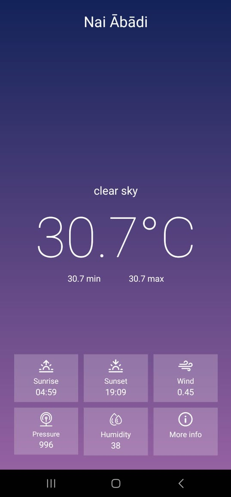

# INTRODUCTION 
## Weather App – Real-time Local Forecasts
This Weather App is a sleek and intuitive Android application that fetches real-time weather information based on your current location. Using modern Android development practices and a reliable weather API, the app delivers accurate temperature, humidity, and condition details right when you need them.

Upon launch, the app securely requests your location permission, then seamlessly fetches and displays weather data tailored to your exact coordinates. Whether you're planning your day or preparing for the week ahead, Weather App ensures you're always one step ahead of the forecast.

## 🌟 Key Highlights
📍 Auto-detects your current location with runtime permission handling

☁️ Real-time weather data fetched from a trusted weather API
https://api.openweathermap.org/data/2.5/weather?lat={lat}&lon={lon}&appid={API key}

🌡️ Displays temperature, weather conditions, humidity, and more

💡 Clean, minimalistic, and user-friendly UI

⚙️ Built using modern Android best practices with Kotlin

## 📸 User Interface
### Home Screen

